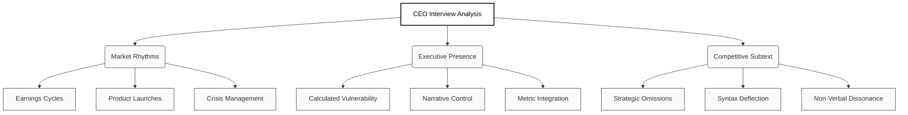

# The Subtext of Leadership: Analyzing CEO Interviews for Strategy and Competitive Intelligence

The modern CEO interview is rarely just a conversation. It is a carefully orchestrated strategic broadcast. For executives, studying these appearances offers a dual opportunity: a masterclass in effective communication and a raw data feed for competitive intelligence.

Over the past twelve months, the volume and velocity of public discourse surrounding CEO interviews have shown distinct rhythmic patterns. Analyzing this social and market chatter reveals exactly when and why audiences pay attention.

### Discussion Volume and Market Catalysts

| Catalyst | Volume Trend | Primary Audience Focus |
| :--- | :--- | :--- |
| **Quarterly Earnings** | Consistent Baseline Peaks | Financial health, forward guidance, and operational efficiency |
| **Major Product Launches** | High Volatility Spikes | Innovation narrative, market disruption, and technical confidence |
| **Crisis or Restructuring** | Maximum Volume | Empathy, accountability, and stabilization strategies |
| **Industry Conferences** | Sustained Engagement | Thought leadership, macroeconomic views, and peer positioning |

*The above trends indicate that while earnings calls provide a steady drumbeat of engagement, anomalous spikes in discussion volume are consistently driven by narrative-heavy events such as major technological pivots or crisis management scenarios.*

### The Anatomy of a Masterful Interview

When a chief executive speaks, the market evaluates more than just the content of their answers. The most compelling interviews are defined by a delicate balance of strategic clarity and calculated vulnerability. 

The modern audience is hyper-aware of overly polished corporate speak and heavily rewards authenticity. A masterclass interview occurs when an executive successfully humanizes their brand while projecting absolute command over its operational reality. They do not merely recite talking points; they build a compelling narrative that connects granular business metrics to a broader industry vision. The goal is to appear highly accessible without compromising authority.

### Competitive Intelligence: Reading Between the Lines

For the astute observer, a competitor's interview is a highly vulnerable moment. Media training can mask many things, but it rarely conceals everything. Analyzing these appearances requires listening to what is not being said and observing the dissonance between verbal claims and non-verbal tells.

**The Strategy of Omission**
If a historically celebrated metric is suddenly absent, or a routine conversational pivot is repeatedly deployed when a specific product line is mentioned, it strongly signals internal concern. In competitive analysis, corporate silence is often the most profound disclosure.

**The Syntax of Deflection**
Grammatical shifts provide immediate insight. A sudden shift from active to passive voice often indicates a subconscious desire to distance leadership from a particular outcome or failure. Furthermore, vague generalities and the sudden introduction of dense corporate jargon normally serve as a smoke screen for areas where the company currently lacks concrete solutions.

**Non-Verbal Contradictions**
A confident statement delivered with a closed posture, erratic eye contact, or a sudden change in vocal pitch betrays a lack of conviction. Micro-expressions—brief, involuntary flashes of frustration or hesitation when specific competitors or macroeconomic headwinds are mentioned—often reveal the true internal narrative that the PR team sought to suppress.

**The Repetition Strategy**
When a specific phrase or framing is aggressively repeated throughout an interview, it is not accidental. It is the core message the executive has been trained to land, revealing their immediate strategic priority or the primary narrative they are desperately attempting to counteract in the market.

By treating peer interviews as both a communication benchmark and a competitive dataset, leaders can refine their own public presence while systematically outmaneuvering their rivals.

